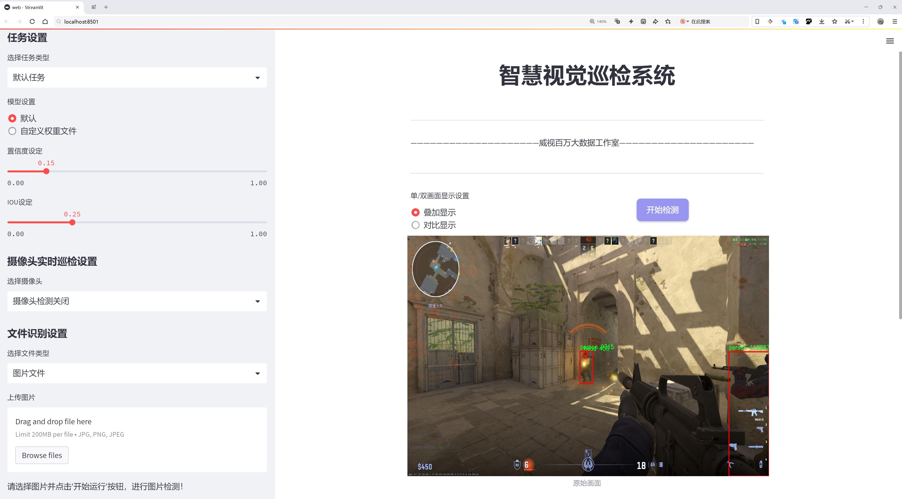

# CSGO敌人和头部检测检测系统源码分享
 # [一条龙教学YOLOV8标注好的数据集一键训练_70+全套改进创新点发刊_Web前端展示]

### 1.研究背景与意义

项目参考[AAAI Association for the Advancement of Artificial Intelligence](https://gitee.com/qunshansj/projects)

项目来源[AACV Association for the Advancement of Computer Vision](https://gitee.com/qunmasj/projects)

研究背景与意义

随着计算机视觉技术的迅速发展，物体检测在各个领域的应用日益广泛，尤其是在视频监控、自动驾驶、智能安防等领域中，物体检测技术的精确性和实时性成为了研究的重点。近年来，深度学习算法的不断进步，尤其是YOLO（You Only Look Once）系列模型的提出，极大地推动了物体检测技术的发展。YOLOv8作为该系列的最新版本，其在速度和精度上的显著提升，使其成为物体检测任务中的重要工具。

在电子竞技领域，尤其是《反恐精英：全球攻势》（CSGO）这款游戏中，敌人和头部的检测不仅关乎游戏的胜负，也涉及到玩家的操作策略和战术布局。通过对敌人和头部的精准检测，玩家能够更快地做出反应，从而提高游戏的竞技性和趣味性。因此，基于YOLOv8的CSGO敌人和头部检测系统的研究具有重要的实际意义。

本研究将基于一个包含1550张图像的数据集进行深入探讨。该数据集分为两个类别：头部和人物。这两个类别的选择不仅符合游戏的实际需求，也为模型的训练和测试提供了丰富的样本。在CSGO的游戏环境中，敌人的头部是最为关键的目标，准确检测头部位置将直接影响到射击的精确度和游戏的胜率。因此，构建一个高效的检测系统，能够实时识别敌人及其头部位置，对于提升玩家的游戏体验和竞技水平具有重要的意义。

此外，随着电子竞技行业的蓬勃发展，相关的技术研究也逐渐受到重视。通过改进YOLOv8模型，结合CSGO的特定场景，能够探索深度学习在动态场景下的应用潜力。这不仅为游戏开发者提供了技术支持，也为学术界提供了新的研究方向。研究结果将为未来的游戏AI系统提供参考，推动智能游戏技术的发展。

在技术层面，YOLOv8的改进将集中在模型的网络结构优化、数据增强技术的应用以及训练策略的调整上。通过这些改进，期望能够提高模型在复杂场景下的检测精度和实时性，从而实现对CSGO游戏中敌人和头部的高效检测。这一研究不仅能够为游戏玩家提供更为精准的辅助工具，也为相关领域的研究提供了新的思路和方法。

综上所述，基于改进YOLOv8的CSGO敌人和头部检测系统的研究，不仅具有重要的理论价值，也具备广泛的应用前景。通过深入分析和实验验证，期望能够为电子竞技的智能化发展贡献一份力量，同时推动计算机视觉技术在游戏领域的进一步应用与发展。

### 2.图片演示





##### 注意：由于此博客编辑较早，上面“2.图片演示”和“3.视频演示”展示的系统图片或者视频可能为老版本，新版本在老版本的基础上升级如下：（实际效果以升级的新版本为准）

  （1）适配了YOLOV8的“目标检测”模型和“实例分割”模型，通过加载相应的权重（.pt）文件即可自适应加载模型。

  （2）支持“图片识别”、“视频识别”、“摄像头实时识别”三种识别模式。

  （3）支持“图片识别”、“视频识别”、“摄像头实时识别”三种识别结果保存导出，解决手动导出（容易卡顿出现爆内存）存在的问题，识别完自动保存结果并导出到tempDir中。

  （4）支持Web前端系统中的标题、背景图等自定义修改，后面提供修改教程。

  另外本项目提供训练的数据集和训练教程,暂不提供权重文件（best.pt）,需要您按照教程进行训练后实现图片演示和Web前端界面演示的效果。

### 3.视频演示

[3.1 视频演示](https://www.bilibili.com/video/BV17U4oeDEfp/)

### 4.数据集信息展示

##### 4.1 本项目数据集详细数据（类别数＆类别名）

nc: 2
names: ['head', 'person']


##### 4.2 本项目数据集信息介绍

数据集信息展示

在现代计算机视觉领域，数据集的构建与应用至关重要，尤其是在特定任务的训练和优化过程中。本研究所使用的数据集名为“csgo”，旨在为改进YOLOv8模型在《反恐精英：全球攻势》（CSGO）游戏环境中的敌人和头部检测系统提供高质量的训练数据。该数据集专注于两个主要类别，分别是“head”（头部）和“person”（人物），共计两个类别（nc: 2）。这种精简而高效的类别设置，使得模型在特定任务上的表现得以显著提升。

“csgo”数据集的构建过程充分考虑了游戏环境的复杂性和多样性。数据集中的图像均来自于游戏的实际场景，涵盖了不同的地图、光照条件以及玩家的动态行为。这种多样性确保了模型在训练过程中能够接触到丰富的视觉信息，从而提高其在实际应用中的泛化能力。每个类别的样本都经过精心标注，确保了数据的准确性和可靠性。在“head”类别中，数据集包含了各种角度和姿态下的玩家头部图像，这对于训练模型识别和定位敌人头部至关重要。而在“person”类别中，数据集则涵盖了完整的人物形象，确保模型能够有效区分敌人和友军。

在数据集的标注过程中，采用了严格的质量控制措施，确保每一张图像的标注信息都符合标准。这种高质量的标注不仅提高了模型的训练效率，也为后续的模型评估提供了可靠的基准。数据集的多样性和高质量标注，使得“csgo”数据集在训练YOLOv8模型时，能够有效地提升其对目标的检测精度和召回率。

此外，为了进一步增强模型的鲁棒性，数据集还包含了一些特殊场景和挑战性条件下的图像。例如，在烟雾、闪光等视觉干扰情况下的敌人检测样本，这些样本的引入使得模型能够在更复杂的环境中保持较高的检测性能。这种设计理念不仅考虑到了游戏中的实际战斗场景，也为模型在真实世界应用中的推广奠定了基础。

总之，“csgo”数据集以其独特的设计和高质量的标注，为改进YOLOv8的敌人和头部检测系统提供了坚实的基础。通过对两个类别的精细划分和多样化的样本选择，该数据集不仅能够有效支持模型的训练，还能在实际应用中展现出优异的性能。随着计算机视觉技术的不断发展，数据集的构建和应用将继续发挥重要作用，而“csgo”数据集无疑是这一领域中的一项重要贡献。


### 5.全套项目环境部署视频教程（零基础手把手教学）

[5.1 环境部署教程链接（零基础手把手教学）](https://www.ixigua.com/7404473917358506534?logTag=c807d0cbc21c0ef59de5)


[5.2 安装Python虚拟环境创建和依赖库安装视频教程链接（零基础手把手教学）](https://www.ixigua.com/7404474678003106304?logTag=1f1041108cd1f708b01a)

### 6.手把手YOLOV8训练视频教程（零基础小白有手就能学会）

[6.1 手把手YOLOV8训练视频教程（零基础小白有手就能学会）](https://www.ixigua.com/7404477157818401292?logTag=d31a2dfd1983c9668658)

### 7.70+种全套YOLOV8创新点代码加载调参视频教程（一键加载写好的改进模型的配置文件）

[7.1 70+种全套YOLOV8创新点代码加载调参视频教程（一键加载写好的改进模型的配置文件）](https://www.ixigua.com/7404478314661806627?logTag=29066f8288e3f4eea3a4)

### 8.70+种全套YOLOV8创新点原理讲解（非科班也可以轻松写刊发刊，V10版本正在科研待更新）

由于篇幅限制，每个创新点的具体原理讲解就不一一展开，具体见下列网址中的创新点对应子项目的技术原理博客网址【Blog】：


[8.1 70+种全套YOLOV8创新点原理讲解链接](https://gitee.com/qunmasj/good)

### 9.系统功能展示（检测对象为举例，实际内容以本项目数据集为准）

图9.1.系统支持检测结果表格显示

  图9.2.系统支持置信度和IOU阈值手动调节

  图9.3.系统支持自定义加载权重文件best.pt(需要你通过步骤5中训练获得)

  图9.4.系统支持摄像头实时识别

  图9.5.系统支持图片识别

  图9.6.系统支持视频识别

  图9.7.系统支持识别结果文件自动保存

  图9.8.系统支持Excel导出检测结果数据


### 10.原始YOLOV8算法原理

原始YOLOv8算法原理

YOLOv8算法是目标检测领域的最新进展，其设计理念和架构在前代YOLO模型的基础上进行了深度优化和创新。作为YOLO系列的最新版本，YOLOv8在性能和效率上都取得了显著的提升，成为了计算机视觉任务中的佼佼者。该算法的核心结构由输入层、主干网络、颈部网络和头部网络组成，每个部分在整个目标检测过程中都扮演着至关重要的角色。

首先，YOLOv8的输入层负责将原始图像进行缩放，以适应模型的输入尺寸要求。这一过程不仅保证了图像的统一性，还为后续的特征提取打下了基础。主干网络是YOLOv8的特征提取核心，其采用了深度卷积神经网络结构，通过一系列卷积操作对输入图像进行下采样，提取出多层次的特征信息。每个卷积层都结合了批归一化和SiLUR激活函数，这种设计旨在加速模型的收敛速度并提高其表达能力。

在主干网络中，C2f块的引入是YOLOv8的一大创新。该模块借鉴了YOLOv7中的E-ELAN结构，通过跨层分支连接来增强模型的梯度流动，从而有效改善检测结果。C2f块通过增加跳跃连接，促进了信息的流动，使得网络在训练过程中能够更好地捕捉到多层次的特征。此外，主干网络末尾的SPPFl块利用三个最大池化层来处理多尺度特征，这一设计增强了网络的特征抽象能力，使得模型在面对不同大小目标时能够表现得更加灵活和精准。

颈部网络则承担着特征融合的任务，利用FPNS（特征金字塔网络）和PAN（路径聚合网络）结构来整合来自不同尺度的特征图信息。这一过程对于提高模型的检测精度至关重要，因为目标的大小和形状各异，颈部网络通过有效融合多层特征，确保了模型在不同场景下的适应性和鲁棒性。最终，经过颈部网络处理后的特征图被传递给头部网络，进行目标的分类和定位。

YOLOv8的头部网络采用了解耦的检测头，这一设计的最大亮点在于将回归和分类的损失计算分开，分别通过两个并行的卷积分支进行处理。这种解耦设计不仅提高了模型的灵活性，还减少了模型在训练过程中的复杂性，使得损失函数的优化更加高效。与传统的Anchor-Based方法不同，YOLOv8引入了Anchor-Free的检测头，这一创新使得模型在处理小目标时表现得更加出色，且避免了Anchor设置不当带来的性能损失。

值得一提的是，YOLOv8在结构上也进行了多项改进，例如将第一个卷积层的kernel从6x6更改为3x3，所有的C3模块被替换为C2f模块，且Backbone中C2f的block数进行了调整。这些改动不仅提升了模型的计算效率，还增强了其特征提取能力。此外，YOLOv8在模型的缩放系数上也进行了优化，使得不同规模的模型能够在各种硬件平台上高效运行。

YOLOv8的推出标志着目标检测技术的一次重要飞跃。通过对YOLOv5、YOLOv6、YOLOX等前代模型的设计优点进行借鉴和融合，YOLOv8在精度和执行速度上均超越了现有的对象检测与实例分割模型。其多尺度训练和测试、特征金字塔网络等新技术的引入，使得YOLOv8能够广泛应用于智能监控、自动驾驶、人脸识别等多种场景。

总的来说，YOLOv8算法的原理在于通过深度卷积神经网络的多层特征提取、有效的特征融合以及解耦的检测头设计，构建出一个高效、精准的目标检测模型。其在各项指标上的全面提升，不仅为目标检测领域带来了新的技术标准，也为实际应用提供了强有力的支持。随着YOLOv8的广泛应用，未来的目标检测任务将更加高效、准确，推动计算机视觉技术的进一步发展。


### 11.项目核心源码讲解（再也不用担心看不懂代码逻辑）

#### 11.1 ui.py

以下是代码的核心部分，并附上详细的中文注释：

```python
import sys
import subprocess

def run_script(script_path):
    """
    使用当前 Python 环境运行指定的脚本。

    Args:
        script_path (str): 要运行的脚本路径

    Returns:
        None
    """
    # 获取当前 Python 解释器的路径
    python_path = sys.executable

    # 构建运行命令，使用 streamlit 运行指定的脚本
    command = f'"{python_path}" -m streamlit run "{script_path}"'

    # 执行命令
    result = subprocess.run(command, shell=True)
    # 检查命令执行的返回码，如果不为0则表示出错
    if result.returncode != 0:
        print("脚本运行出错。")

# 实例化并运行应用
if __name__ == "__main__":
    # 指定要运行的脚本路径
    script_path = "web.py"  # 这里可以直接指定脚本名，假设在当前目录下

    # 调用函数运行脚本
    run_script(script_path)
```

### 代码分析与注释：
1. **导入模块**：
   - `sys`：用于访问与 Python 解释器相关的变量和函数。
   - `subprocess`：用于创建新进程、连接到它们的输入/输出/错误管道，并获得返回码。

2. **`run_script` 函数**：
   - 该函数接受一个参数 `script_path`，表示要运行的 Python 脚本的路径。
   - 使用 `sys.executable` 获取当前 Python 解释器的路径，以确保使用正确的 Python 环境来运行脚本。
   - 构建一个命令字符串，使用 `streamlit` 模块运行指定的脚本。
   - 使用 `subprocess.run` 执行构建的命令，并通过 `shell=True` 允许在 shell 中执行命令。
   - 检查命令的返回码，如果返回码不为0，表示脚本运行出错，打印错误信息。

3. **主程序入口**：
   - 使用 `if __name__ == "__main__":` 确保只有在直接运行该脚本时才会执行以下代码。
   - 指定要运行的脚本路径 `script_path`，在这里假设脚本名为 `web.py`。
   - 调用 `run_script` 函数来执行指定的脚本。 

这样，代码的核心逻辑和功能得以保留，并且每个部分都有详细的中文注释，便于理解。

这个程序文件 `ui.py` 的主要功能是通过当前的 Python 环境来运行一个指定的脚本，具体来说是运行一个名为 `web.py` 的脚本。文件中首先导入了一些必要的模块，包括 `sys`、`os` 和 `subprocess`，这些模块分别用于获取系统信息、处理文件路径和执行系统命令。

在 `run_script` 函数中，首先获取当前 Python 解释器的路径，这样可以确保使用正确的 Python 环境来运行脚本。接着，构建一个命令字符串，该命令使用 `streamlit` 来运行指定的脚本。`streamlit` 是一个用于构建数据应用的框架，命令的格式为 `python -m streamlit run script_path`，其中 `script_path` 是要运行的脚本的路径。

随后，使用 `subprocess.run` 方法来执行这个命令。这个方法会在一个新的子进程中运行命令，并等待其完成。如果脚本运行过程中出现错误，返回的 `returncode` 将不为零，此时程序会打印出“脚本运行出错”的提示信息。

在文件的最后部分，使用 `if __name__ == "__main__":` 语句来确保当该文件作为主程序运行时，才会执行后面的代码。这里指定了要运行的脚本路径为 `web.py`，并调用 `run_script` 函数来执行这个脚本。

总的来说，这个文件的作用是提供一个简单的接口，通过当前的 Python 环境来运行一个 Streamlit 应用脚本，并处理可能出现的错误。

#### 11.2 code\ultralytics\models\yolo\detect\predict.py

以下是代码中最核心的部分，并附上详细的中文注释：

```python
from ultralytics.engine.predictor import BasePredictor
from ultralytics.engine.results import Results
from ultralytics.utils import ops

class DetectionPredictor(BasePredictor):
    """
    DetectionPredictor类，继承自BasePredictor类，用于基于检测模型进行预测。
    """

    def postprocess(self, preds, img, orig_imgs):
        """
        对预测结果进行后处理，并返回Results对象的列表。

        参数:
        preds: 模型的预测结果
        img: 输入图像
        orig_imgs: 原始图像（可能是torch.Tensor或numpy数组）

        返回:
        results: 包含处理后结果的Results对象列表
        """
        # 使用非极大值抑制（NMS）来过滤预测框
        preds = ops.non_max_suppression(
            preds,
            self.args.conf,  # 置信度阈值
            self.args.iou,   # IOU阈值
            agnostic=self.args.agnostic_nms,  # 是否使用类别无关的NMS
            max_det=self.args.max_det,  # 最大检测框数量
            classes=self.args.classes,   # 需要检测的类别
        )

        # 如果输入的原始图像不是列表，则将其转换为numpy数组
        if not isinstance(orig_imgs, list):  # 输入图像是torch.Tensor，而不是列表
            orig_imgs = ops.convert_torch2numpy_batch(orig_imgs)

        results = []  # 初始化结果列表
        for i, pred in enumerate(preds):  # 遍历每个预测结果
            orig_img = orig_imgs[i]  # 获取对应的原始图像
            # 将预测框的坐标缩放到原始图像的尺寸
            pred[:, :4] = ops.scale_boxes(img.shape[2:], pred[:, :4], orig_img.shape)
            img_path = self.batch[0][i]  # 获取图像路径
            # 创建Results对象并添加到结果列表中
            results.append(Results(orig_img, path=img_path, names=self.model.names, boxes=pred))
        
        return results  # 返回处理后的结果列表
```

### 代码核心部分说明：
1. **类定义**：`DetectionPredictor`类用于处理基于YOLO模型的目标检测预测。
2. **后处理方法**：`postprocess`方法对模型的预测结果进行后处理，包括应用非极大值抑制（NMS）和坐标缩放，以便将预测框适配到原始图像的尺寸。
3. **结果返回**：该方法最终返回一个包含多个`Results`对象的列表，每个对象代表一张图像的检测结果。

这个程序文件是Ultralytics YOLO模型中的一个预测模块，主要用于基于检测模型进行目标检测的预测。文件中定义了一个名为`DetectionPredictor`的类，它继承自`BasePredictor`类。该类的主要功能是处理输入图像并生成检测结果。

在类的文档字符串中，提供了一个使用示例，展示了如何创建`DetectionPredictor`的实例并调用其预测功能。示例中，首先从Ultralytics库中导入必要的模块，然后定义了一个包含模型路径和数据源的参数字典，接着实例化`DetectionPredictor`并调用`predict_cli()`方法进行预测。

`DetectionPredictor`类中包含一个名为`postprocess`的方法，该方法用于对模型的预测结果进行后处理。具体来说，首先调用`ops.non_max_suppression`函数对预测结果进行非极大值抑制，以去除冗余的检测框。这个过程使用了一些参数，如置信度阈值、IOU阈值、是否进行类别无关的NMS、最大检测框数量以及需要检测的类别。

接下来，方法检查输入的原始图像是否为列表形式。如果不是，则将其转换为NumPy数组。然后，方法遍历每个预测结果，并根据原始图像的尺寸调整检测框的位置。最后，将处理后的结果封装为`Results`对象，并返回一个包含所有结果的列表。

总的来说，这个文件的核心功能是实现YOLO模型的目标检测预测，并对预测结果进行后处理，以便于后续的结果分析和展示。

#### 11.3 code\ultralytics\models\yolo\pose\train.py

以下是代码中最核心的部分，并附上详细的中文注释：

```python
from ultralytics.models import yolo
from ultralytics.nn.tasks import PoseModel
from ultralytics.utils import DEFAULT_CFG, LOGGER
from ultralytics.utils.plotting import plot_images, plot_results

class PoseTrainer(yolo.detect.DetectionTrainer):
    """
    PoseTrainer类，扩展了DetectionTrainer类，用于基于姿态模型的训练。
    """

    def __init__(self, cfg=DEFAULT_CFG, overrides=None, _callbacks=None):
        """初始化PoseTrainer对象，使用指定的配置和覆盖参数。"""
        if overrides is None:
            overrides = {}
        overrides["task"] = "pose"  # 设置任务类型为姿态估计
        super().__init__(cfg, overrides, _callbacks)  # 调用父类构造函数

        # 检查设备是否为Apple MPS，并给出警告
        if isinstance(self.args.device, str) and self.args.device.lower() == "mps":
            LOGGER.warning(
                "WARNING ⚠️ Apple MPS known Pose bug. Recommend 'device=cpu' for Pose models."
            )

    def get_model(self, cfg=None, weights=None, verbose=True):
        """获取指定配置和权重的姿态估计模型。"""
        # 创建PoseModel实例
        model = PoseModel(cfg, ch=3, nc=self.data["nc"], data_kpt_shape=self.data["kpt_shape"], verbose=verbose)
        if weights:
            model.load(weights)  # 加载指定的权重

        return model  # 返回模型

    def set_model_attributes(self):
        """设置PoseModel的关键点形状属性。"""
        super().set_model_attributes()  # 调用父类方法
        self.model.kpt_shape = self.data["kpt_shape"]  # 设置关键点形状

    def get_validator(self):
        """返回PoseValidator类的实例以进行验证。"""
        self.loss_names = "box_loss", "pose_loss", "kobj_loss", "cls_loss", "dfl_loss"  # 定义损失名称
        return yolo.pose.PoseValidator(
            self.test_loader, save_dir=self.save_dir, args=copy(self.args), _callbacks=self.callbacks
        )  # 返回PoseValidator实例

    def plot_training_samples(self, batch, ni):
        """绘制一批训练样本，包括标注的类别标签、边界框和关键点。"""
        images = batch["img"]  # 获取图像
        kpts = batch["keypoints"]  # 获取关键点
        cls = batch["cls"].squeeze(-1)  # 获取类别
        bboxes = batch["bboxes"]  # 获取边界框
        paths = batch["im_file"]  # 获取图像文件路径
        batch_idx = batch["batch_idx"]  # 获取批次索引
        plot_images(
            images,
            batch_idx,
            cls,
            bboxes,
            kpts=kpts,
            paths=paths,
            fname=self.save_dir / f"train_batch{ni}.jpg",  # 保存图像的文件名
            on_plot=self.on_plot,
        )

    def plot_metrics(self):
        """绘制训练/验证指标。"""
        plot_results(file=self.csv, pose=True, on_plot=self.on_plot)  # 保存结果图像
```

### 代码核心部分说明：
1. **PoseTrainer类**：这是一个用于姿态估计的训练类，继承自YOLO的检测训练器。
2. **初始化方法**：设置任务类型为姿态估计，并处理设备兼容性问题。
3. **获取模型**：根据配置和权重创建姿态模型。
4. **设置模型属性**：设置模型的关键点形状属性。
5. **获取验证器**：返回用于验证的PoseValidator实例。
6. **绘制训练样本**：可视化训练样本，包括图像、关键点和边界框。
7. **绘制指标**：可视化训练和验证的指标结果。

这个程序文件是一个用于训练姿态估计模型的Python脚本，属于Ultralytics YOLO（You Only Look Once）系列。它扩展了YOLO的检测训练器，专门用于处理姿态识别任务。文件中定义了一个名为`PoseTrainer`的类，继承自`yolo.detect.DetectionTrainer`，并提供了一些特定于姿态模型的功能。

在`PoseTrainer`类的构造函数中，首先会初始化一些配置参数。如果没有提供覆盖参数，默认会创建一个空字典，并将任务类型设置为“pose”。然后调用父类的构造函数进行初始化。如果设备类型是“mps”（即Apple的Metal Performance Shaders），则会发出警告，建议使用CPU进行姿态模型的训练，以避免已知的兼容性问题。

`get_model`方法用于获取姿态估计模型。它会根据传入的配置和权重来创建一个`PoseModel`实例，并在提供权重的情况下加载这些权重。这个模型的输入通道数和关键点数量会根据数据集的配置进行设置。

`set_model_attributes`方法用于设置模型的关键点形状属性，这个属性是从数据集中提取的。通过调用父类的方法，确保其他必要的模型属性也被正确设置。

`get_validator`方法返回一个姿态验证器的实例，用于在训练过程中进行模型验证。它会设置损失名称，并将测试加载器、保存目录、参数等信息传递给验证器。

`plot_training_samples`方法用于可视化一批训练样本，包括图像、类别标签、边界框和关键点。它会调用`plot_images`函数，将这些信息绘制到图像上，并保存为JPEG文件。

最后，`plot_metrics`方法用于绘制训练和验证过程中的指标，调用`plot_results`函数生成结果图像，并保存到指定的文件中。

总体而言，这个文件为姿态估计模型的训练提供了一个完整的框架，涵盖了模型的初始化、训练、验证和结果可视化等多个方面。

#### 11.4 code\ultralytics\nn\modules\block.py

以下是经过简化并添加详细中文注释的核心代码部分：

```python
import torch
import torch.nn as nn
import torch.nn.functional as F

class DFL(nn.Module):
    """
    分布焦点损失（DFL）模块。
    该模块用于计算焦点损失，主要用于目标检测任务。
    """

    def __init__(self, c1=16):
        """初始化一个卷积层，输入通道数为c1。"""
        super().__init__()
        # 创建一个1x1的卷积层，输出通道为1，不使用偏置
        self.conv = nn.Conv2d(c1, 1, 1, bias=False).requires_grad_(False)
        # 初始化卷积层的权重为0到c1的范围
        x = torch.arange(c1, dtype=torch.float)
        self.conv.weight.data[:] = nn.Parameter(x.view(1, c1, 1, 1))
        self.c1 = c1  # 保存输入通道数

    def forward(self, x):
        """前向传播，应用DFL模块。"""
        b, c, a = x.shape  # 获取输入的批次大小、通道数和锚点数
        # 对输入进行变形和softmax处理，然后通过卷积层
        return self.conv(x.view(b, 4, self.c1, a).transpose(2, 1).softmax(1)).view(b, 4, a)

class Proto(nn.Module):
    """YOLOv8掩膜原型模块，用于分割模型。"""

    def __init__(self, c1, c_=256, c2=32):
        """初始化YOLOv8掩膜原型模块，指定原型和掩膜的数量。"""
        super().__init__()
        self.cv1 = Conv(c1, c_, k=3)  # 第一个卷积层
        self.upsample = nn.ConvTranspose2d(c_, c_, 2, 2, 0, bias=True)  # 上采样层
        self.cv2 = Conv(c_, c_, k=3)  # 第二个卷积层
        self.cv3 = Conv(c_, c2)  # 第三个卷积层

    def forward(self, x):
        """通过上采样和卷积层进行前向传播。"""
        return self.cv3(self.cv2(self.upsample(self.cv1(x))))

class HGStem(nn.Module):
    """
    PPHGNetV2的StemBlock，包含5个卷积层和一个最大池化层。
    """

    def __init__(self, c1, cm, c2):
        """初始化StemBlock，指定输入输出通道。"""
        super().__init__()
        self.stem1 = Conv(c1, cm, 3, 2, act=nn.ReLU())  # 第一个卷积层
        self.stem2a = Conv(cm, cm // 2, 2, 1, 0, act=nn.ReLU())  # 第二个卷积层
        self.stem2b = Conv(cm // 2, cm, 2, 1, 0, act=nn.ReLU())  # 第三个卷积层
        self.stem3 = Conv(cm * 2, cm, 3, 2, act=nn.ReLU())  # 第四个卷积层
        self.stem4 = Conv(cm, c2, 1, 1, act=nn.ReLU())  # 第五个卷积层
        self.pool = nn.MaxPool2d(kernel_size=2, stride=1, padding=0, ceil_mode=True)  # 最大池化层

    def forward(self, x):
        """前向传播，经过多个卷积层和池化层。"""
        x = self.stem1(x)  # 经过第一个卷积层
        x = F.pad(x, [0, 1, 0, 1])  # 对x进行填充
        x2 = self.stem2a(x)  # 经过第二个卷积层
        x2 = F.pad(x2, [0, 1, 0, 1])  # 对x2进行填充
        x2 = self.stem2b(x2)  # 经过第三个卷积层
        x1 = self.pool(x)  # 经过最大池化层
        x = torch.cat([x1, x2], dim=1)  # 在通道维度上拼接x1和x2
        x = self.stem3(x)  # 经过第四个卷积层
        x = self.stem4(x)  # 经过第五个卷积层
        return x  # 返回最终输出

# 省略其他类的定义以保持简洁性
```

以上代码展示了YOLO模型中的几个核心模块，包括分布焦点损失（DFL）、掩膜原型（Proto）和StemBlock（HGStem）。每个模块都有详细的中文注释，解释了其功能和结构。

这个程序文件定义了一系列用于构建神经网络模块的类，主要用于实现Ultralytics YOLO（You Only Look Once）模型中的不同组件。文件中使用了PyTorch框架，包含了多个卷积层、池化层和其他结构的实现。

首先，文件导入了必要的PyTorch库和一些自定义的卷积模块，如`Conv`、`DWConv`、`GhostConv`等，这些模块可能实现了不同类型的卷积操作，旨在提高模型的性能和效率。

接下来，文件定义了一些类，每个类都继承自`nn.Module`，表示一个神经网络的层或模块。以下是一些关键模块的简要说明：

1. **DFL（Distribution Focal Loss）**：这个模块实现了分布焦点损失的计算，主要用于目标检测任务中，以提高模型对难以分类样本的关注。

2. **Proto**：YOLOv8中的掩膜原型模块，主要用于分割模型。它通过多个卷积层和上采样层来处理输入数据，生成掩膜。

3. **HGStem**：PPHGNetV2的StemBlock，包含多个卷积层和一个最大池化层，用于特征提取。

4. **HGBlock**：PPHGNetV2中的HG块，包含多个卷积层，使用轻量级卷积（LightConv）来减少计算量。

5. **SPP（Spatial Pyramid Pooling）**：空间金字塔池化层，能够处理不同尺度的特征图，提高模型的鲁棒性。

6. **C1、C2、C3等**：这些类实现了不同的CSP（Cross Stage Partial）瓶颈结构，旨在通过分离特征图来增强模型的表达能力。每个类的构造函数允许用户指定输入和输出通道数、卷积层的数量等参数。

7. **Bottleneck和BottleneckCSP**：标准瓶颈模块和CSP瓶颈模块，分别实现了常规的和跨阶段的特征融合。

8. **ResNetBlock和ResNetLayer**：实现了ResNet架构中的基本块和层，允许构建深层网络。

每个模块都有一个`forward`方法，定义了前向传播的计算过程，输入数据经过各层的处理后输出特征图。整体上，这些模块可以组合成更复杂的网络结构，适用于目标检测、图像分割等计算机视觉任务。

通过这种模块化的设计，用户可以灵活地构建和调整网络结构，以满足特定任务的需求。

#### 11.5 train.py

以下是代码中最核心的部分，并附上详细的中文注释：

```python
class DetectionTrainer(BaseTrainer):
    """
    DetectionTrainer类，继承自BaseTrainer类，用于基于检测模型的训练。
    """

    def build_dataset(self, img_path, mode="train", batch=None):
        """
        构建YOLO数据集。

        参数:
            img_path (str): 包含图像的文件夹路径。
            mode (str): 模式，可以是'train'或'val'，用户可以为每种模式自定义不同的数据增强。
            batch (int, optional): 批次大小，仅用于'rect'模式。默认为None。
        """
        gs = max(int(de_parallel(self.model).stride.max() if self.model else 0), 32)
        return build_yolo_dataset(self.args, img_path, batch, self.data, mode=mode, rect=mode == "val", stride=gs)

    def get_dataloader(self, dataset_path, batch_size=16, rank=0, mode="train"):
        """构造并返回数据加载器。"""
        assert mode in ["train", "val"]  # 确保模式是'train'或'val'
        with torch_distributed_zero_first(rank):  # 在分布式训练中，确保数据集只初始化一次
            dataset = self.build_dataset(dataset_path, mode, batch_size)  # 构建数据集
        shuffle = mode == "train"  # 训练模式下打乱数据
        if getattr(dataset, "rect", False) and shuffle:
            LOGGER.warning("WARNING ⚠️ 'rect=True'与DataLoader的shuffle不兼容，设置shuffle=False")
            shuffle = False
        workers = self.args.workers if mode == "train" else self.args.workers * 2  # 设置工作线程数
        return build_dataloader(dataset, batch_size, workers, shuffle, rank)  # 返回数据加载器

    def preprocess_batch(self, batch):
        """对一批图像进行预处理，包括缩放和转换为浮点数。"""
        batch["img"] = batch["img"].to(self.device, non_blocking=True).float() / 255  # 将图像转移到设备并归一化
        if self.args.multi_scale:  # 如果启用多尺度
            imgs = batch["img"]
            sz = (
                random.randrange(self.args.imgsz * 0.5, self.args.imgsz * 1.5 + self.stride)
                // self.stride
                * self.stride
            )  # 随机选择新的尺寸
            sf = sz / max(imgs.shape[2:])  # 计算缩放因子
            if sf != 1:
                ns = [
                    math.ceil(x * sf / self.stride) * self.stride for x in imgs.shape[2:]
                ]  # 计算新的形状
                imgs = nn.functional.interpolate(imgs, size=ns, mode="bilinear", align_corners=False)  # 进行插值
            batch["img"] = imgs  # 更新批次图像
        return batch

    def get_model(self, cfg=None, weights=None, verbose=True):
        """返回YOLO检测模型。"""
        model = DetectionModel(cfg, nc=self.data["nc"], verbose=verbose and RANK == -1)  # 创建检测模型
        if weights:
            model.load(weights)  # 加载权重
        return model

    def get_validator(self):
        """返回YOLO模型验证器。"""
        self.loss_names = "box_loss", "cls_loss", "dfl_loss"  # 定义损失名称
        return yolo.detect.DetectionValidator(
            self.test_loader, save_dir=self.save_dir, args=copy(self.args), _callbacks=self.callbacks
        )  # 返回验证器

    def plot_training_samples(self, batch, ni):
        """绘制带有注释的训练样本。"""
        plot_images(
            images=batch["img"],
            batch_idx=batch["batch_idx"],
            cls=batch["cls"].squeeze(-1),
            bboxes=batch["bboxes"],
            paths=batch["im_file"],
            fname=self.save_dir / f"train_batch{ni}.jpg",
            on_plot=self.on_plot,
        )  # 绘制图像并保存

    def plot_metrics(self):
        """从CSV文件绘制指标。"""
        plot_results(file=self.csv, on_plot=self.on_plot)  # 保存结果图像
```

### 代码核心部分说明：
1. **DetectionTrainer类**：该类用于实现YOLO模型的训练，继承自基础训练类`BaseTrainer`。
2. **build_dataset方法**：用于构建YOLO数据集，接受图像路径、模式和批次大小作为参数。
3. **get_dataloader方法**：构造数据加载器，确保在分布式训练中只初始化一次数据集。
4. **preprocess_batch方法**：对图像批次进行预处理，包括归一化和多尺度调整。
5. **get_model方法**：返回YOLO检测模型，并可选择加载预训练权重。
6. **get_validator方法**：返回用于模型验证的验证器。
7. **plot_training_samples和plot_metrics方法**：用于可视化训练样本和训练指标。

这个程序文件 `train.py` 是一个用于训练 YOLO（You Only Look Once）目标检测模型的实现，基于 Ultralytics 提供的框架。文件中定义了一个名为 `DetectionTrainer` 的类，继承自 `BaseTrainer`，并包含了一系列方法来构建数据集、获取数据加载器、预处理图像、设置模型属性、获取模型、验证模型、记录损失、显示训练进度、绘制训练样本和绘制训练指标等功能。

在 `DetectionTrainer` 类中，`build_dataset` 方法用于构建 YOLO 数据集，接受图像路径、模式（训练或验证）和批量大小作为参数。该方法首先确定模型的步幅，然后调用 `build_yolo_dataset` 函数生成数据集。

`get_dataloader` 方法则用于构建数据加载器，确保在分布式训练中只初始化一次数据集。根据模式（训练或验证），该方法设置是否打乱数据，并调用 `build_dataloader` 返回数据加载器。

`preprocess_batch` 方法负责对输入的图像批次进行预处理，包括将图像缩放到适当的大小并转换为浮点数格式。若启用多尺度训练，图像会被随机缩放到一定范围内。

`set_model_attributes` 方法用于设置模型的属性，包括类别数量和类别名称，以便模型能够正确处理数据。

`get_model` 方法返回一个 YOLO 检测模型，支持加载预训练权重。

`get_validator` 方法返回一个用于验证模型的 `DetectionValidator` 实例，记录损失名称以便后续分析。

`label_loss_items` 方法生成一个包含训练损失项的字典，便于监控训练过程中的损失变化。

`progress_string` 方法返回一个格式化的字符串，显示训练进度，包括当前的 epoch、GPU 内存使用情况、损失值、实例数量和图像大小。

`plot_training_samples` 方法用于绘制训练样本及其标注，便于可视化训练数据的质量。

最后，`plot_metrics` 和 `plot_training_labels` 方法分别用于绘制训练过程中的指标和生成带标签的训练图，以帮助分析模型的训练效果。

整体来看，这个文件为 YOLO 模型的训练提供了全面的支持，涵盖了数据处理、模型构建、训练监控和结果可视化等多个方面。

#### 11.6 predict.py

以下是代码中最核心的部分，并附上详细的中文注释：

```python
from ultralytics.engine.predictor import BasePredictor
from ultralytics.engine.results import Results
from ultralytics.utils import ops

class DetectionPredictor(BasePredictor):
    """
    DetectionPredictor类扩展了BasePredictor类，用于基于检测模型进行预测。
    """

    def postprocess(self, preds, img, orig_imgs):
        """后处理预测结果并返回Results对象的列表。"""
        
        # 使用非极大值抑制（NMS）来过滤预测框
        preds = ops.non_max_suppression(
            preds,  # 预测框
            self.args.conf,  # 置信度阈值
            self.args.iou,  # IOU阈值
            agnostic=self.args.agnostic_nms,  # 是否使用类别无关的NMS
            max_det=self.args.max_det,  # 最大检测框数量
            classes=self.args.classes,  # 过滤的类别
        )

        # 如果输入的原始图像不是列表，则将其转换为numpy数组
        if not isinstance(orig_imgs, list):  # 输入图像是torch.Tensor，而不是列表
            orig_imgs = ops.convert_torch2numpy_batch(orig_imgs)  # 转换为numpy数组

        results = []  # 初始化结果列表
        for i, pred in enumerate(preds):  # 遍历每个预测框
            orig_img = orig_imgs[i]  # 获取对应的原始图像
            # 将预测框的坐标缩放到原始图像的尺寸
            pred[:, :4] = ops.scale_boxes(img.shape[2:], pred[:, :4], orig_img.shape)
            img_path = self.batch[0][i]  # 获取图像路径
            # 将原始图像、路径、类别名称和预测框信息封装成Results对象
            results.append(Results(orig_img, path=img_path, names=self.model.names, boxes=pred))
        
        return results  # 返回结果列表
```

### 代码说明：
1. **导入模块**：导入了所需的类和函数，包括基础预测器、结果处理类和一些操作工具。
2. **DetectionPredictor类**：这是一个用于目标检测的预测器类，继承自`BasePredictor`。
3. **postprocess方法**：该方法负责对模型的预测结果进行后处理，包括应用非极大值抑制（NMS）和将预测框坐标缩放到原始图像的尺寸。
4. **非极大值抑制**：通过NMS来过滤掉重叠的预测框，以保留最有可能的框。
5. **图像转换**：如果输入的原始图像不是列表格式，则将其转换为numpy数组，以便后续处理。
6. **结果封装**：将处理后的结果封装成`Results`对象，包含原始图像、图像路径、类别名称和预测框信息，最终返回结果列表。

这个程序文件 `predict.py` 是一个用于目标检测的预测类，继承自 `BasePredictor` 类，属于 Ultralytics YOLO 框架的一部分。它的主要功能是对输入的图像进行目标检测，并对检测结果进行后处理。

在这个类中，`postprocess` 方法是关键部分，它负责处理模型的预测结果。首先，它调用 `ops.non_max_suppression` 函数对预测结果进行非极大值抑制（NMS），以去除重复的检测框。这个过程需要传入多个参数，包括置信度阈值、IOU阈值、是否使用类别无关的 NMS、最大检测框数量以及要检测的类别。

接下来，方法检查输入的原始图像是否为列表。如果不是，则将其转换为 NumPy 数组，以便后续处理。然后，程序会遍历每个预测结果，并对每个检测框进行坐标缩放，以适应原始图像的尺寸。最后，程序将原始图像、图像路径、模型名称和检测框信息封装成 `Results` 对象，并将这些对象存储在结果列表中。

该类的使用示例展示了如何初始化 `DetectionPredictor`，并通过命令行接口进行预测。用户可以通过传入模型文件和数据源来创建预测器实例，然后调用 `predict_cli` 方法开始预测。

总体来说，这个文件实现了一个高效的目标检测预测流程，能够处理输入图像并返回经过后处理的检测结果。

### 12.系统整体结构（节选）

### 整体功能和构架概括

该程序的整体功能是实现一个基于YOLO（You Only Look Once）架构的目标检测系统，主要包括模型的训练、预测和后处理。系统由多个模块组成，每个模块负责特定的功能，如数据加载、模型构建、训练过程管理、预测和结果可视化等。通过这些模块的组合，用户可以方便地进行目标检测任务。

- **训练模块**：负责构建数据集、设置模型参数、执行训练过程并监控训练进度。
- **预测模块**：处理输入图像，执行目标检测，并对检测结果进行后处理。
- **模型模块**：定义了各种神经网络结构和组件，以便于构建YOLO模型。
- **工具模块**：提供了一些辅助功能，如自动批处理、数据验证等。

以下是各个文件的功能整理表格：

| 文件路径                                                                                       | 功能描述                                                                                       |
|------------------------------------------------------------------------------------------------|-----------------------------------------------------------------------------------------------|
| `D:\tools\20240809\code\ui.py`                                                                | 提供一个接口，通过当前Python环境运行指定的Streamlit应用脚本。                                 |
| `D:\tools\20240809\code\code\ultralytics\models\yolo\detect\predict.py`                     | 实现目标检测的预测类，处理输入图像并返回经过后处理的检测结果。                               |
| `D:\tools\20240809\code\code\ultralytics\models\yolo\pose\train.py`                        | 用于训练姿态估计模型，包含数据集构建、模型初始化、训练和验证等功能。                        |
| `D:\tools\20240809\code\code\ultralytics\nn\modules\block.py`                               | 定义神经网络模块，包括卷积层、池化层和其他结构，用于构建YOLO模型。                           |
| `D:\tools\20240809\code\train.py`                                                            | 负责YOLO模型的训练过程，包括数据处理、模型构建、训练监控和结果可视化等功能。               |
| `D:\tools\20240809\code\predict.py`                                                          | 实现目标检测的预测流程，处理输入图像并返回检测结果。                                       |
| `70+种YOLOv8算法改进源码大全和调试加载训练教程（非必要）\ultralytics\utils\autobatch.py`     | 提供自动批处理功能，优化数据加载和模型推理过程。                                             |
| `70+种YOLOv8算法改进源码大全和调试加载训练教程（非必要）\ultralytics\engine\__init__.py`   | 初始化YOLO引擎，整合各个模块以便于模型的训练和推理。                                         |
| `70+种YOLOv8算法改进源码大全和调试加载训练教程（非必要）\ultralytics\models\rtdetr\val.py`  | 实现RTDETR模型的验证过程，评估模型性能。                                                    |
| `70+种YOLOv8算法改进源码大全和调试加载训练教程（非必要）\ultralytics\utils\triton.py`      | 提供与Triton推理服务器的集成，支持模型的高效推理。                                          |
| `code\ultralytics\nn\modules\__init__.py`                                                   | 初始化神经网络模块，整合各个子模块以便于使用。                                               |
| `code\ultralytics\models\yolo\obb\__init__.py`                                              | 初始化YOLO OBB（Oriented Bounding Box）模块，支持方向性边界框的检测。                       |
| `70+种YOLOv8算法改进源码大全和调试加载训练教程（非必要）\ultralytics\nn\modules\block.py`     | 定义YOLO模型中的各种神经网络模块，支持不同的网络结构和功能。                                 |

通过这些模块的协同工作，用户可以高效地进行目标检测任务的训练和推理，充分利用YOLO架构的优势。

注意：由于此博客编辑较早，上面“11.项目核心源码讲解（再也不用担心看不懂代码逻辑）”中部分代码可能会优化升级，仅供参考学习，完整“训练源码”、“Web前端界面”和“70+种创新点源码”以“13.完整训练+Web前端界面+70+种创新点源码、数据集获取”的内容为准。

### 13.完整训练+Web前端界面+70+种创新点源码、数据集获取


# [下载链接：https://mbd.pub/o/bread/ZpuVkp9p](https://mbd.pub/o/bread/ZpuVkp9p)